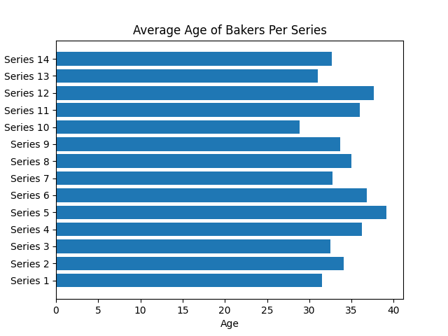
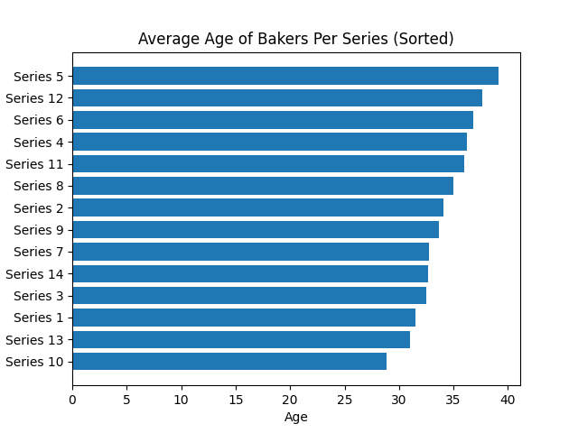
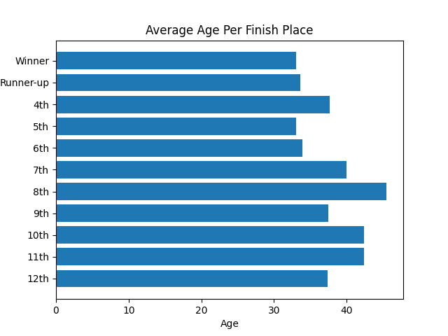
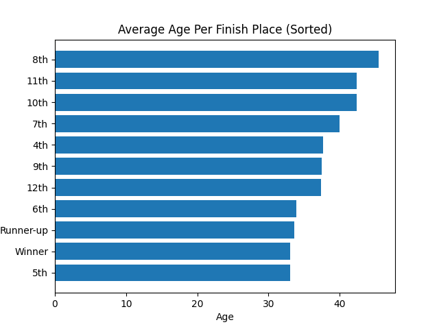
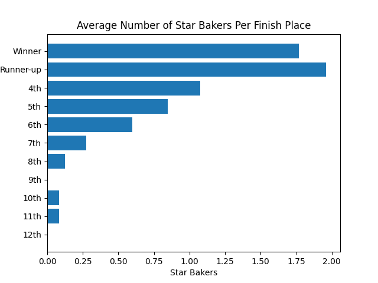
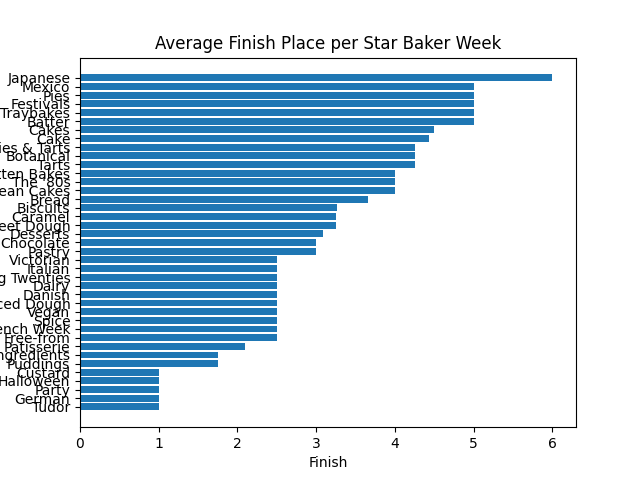
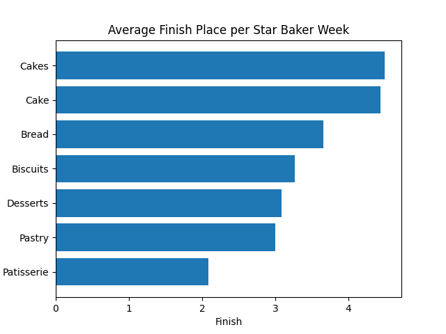

# Findings

This document serves to detail any findings from data in the `data` folder. All graphs are generated from scripts in the `scripts` folder using Python library [matplotlib](https://matplotlib.org/).

## Age

### Average Age of Bakers Per Series

Investigating the average age of bakers reveals the following charts.

This shows that the maximum average age was from **Series 5**, and the minimum was from **Series 10**.

### Average Age Per Finish Place

Generally, it would appear that with age comes more experience. So it would be expected that the older the baker, the better the finish place.

This assumption does not appear to be directly supported by the given results. In fact, the opposite of that claim appears to be somewhat indicated.

The average ages for the finish places of **Winner**, **Runner-up**, **11th**, and **10th** seem to support this opposite claim. However, the finish places of **12th** and **6th** contradict the claim, so this correlation is fully sound.

## Star Bakers

### Average Number of Star Bakers Per Finish Place

It would seem a pretty straight forward conclusion that the number of Star Bakers per contestant correlates with a better finishing place. Investigating this directly shows the following results.

This assumption seems pretty well established from the chart. However, this correlation is not perfect as seen in the discrepency between the winners and runner-ups averages. 

> Note that the 12th place Star Baker row is currently not useful, as the current show format does not allow 12th place bakers to also recieve a Star Baker. 

### Average Finish Place Per Star Baker Week

Each week, the bakers skills are tested in unique ways. Since getting a Star Baker for a given week is a demonstration of proficiency in that week's techniques, perhaps some proficiencies are more indicative of overall finish place.

As seen above, there appears to be a large difference in effect of winning a Star Baker amoung different week techniques. However, this graph does not show the number of times these techniques have occured on the show. Since Star Bakers [generally correspond to a higher finish placement](#average-number-of-star-bakers-per-finish-place), techniques with a low number of occurences will be biased to a high averge finish place. A minimum of 3 occurences of a technique was selected to leviate this bias

Given this domain restriction, we can also see a general trend in common techniques used on the show. It appears that specialized techniques such as patisserie and pastry lead to higher finish placements. Cake technique which while commonly used in many weeks may not be as indicitive of a higher placement. Perhaps mastery of higher precision techniques like patisserie are also a general indication of general proficiency of other baking techniques.

> Note that both the weeks **Cakes** and **Cake** appear in the graph. It might be worth combinding cases like these in the future. 